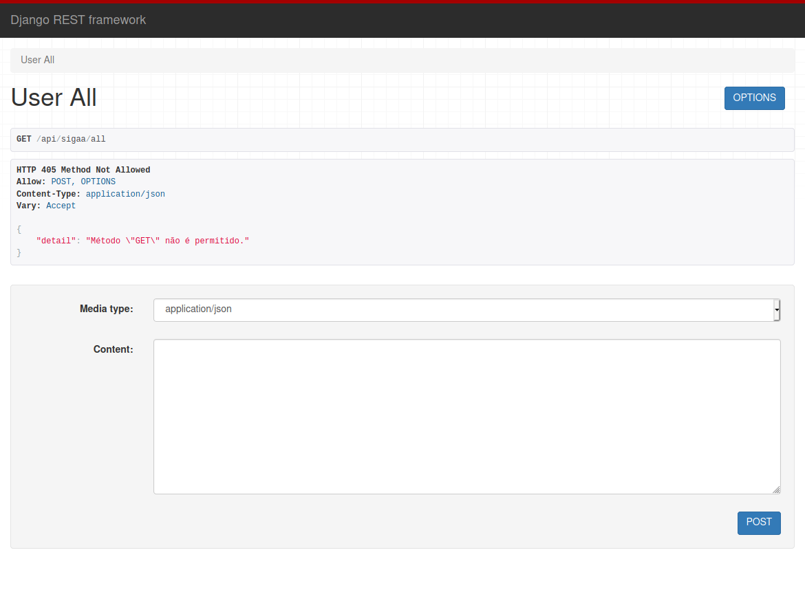

[](https://github.com/marcos-bah/connect_sigaa_server/actions/workflows/django.yml)


 

<!-- PROJECT LOGO -->
<br />
<p align="center">
  <a href="https://github.com/marcos-bah/connect_sigaa_server">
    
  </a>

  <h3 align="center">Connect Sigaa Server [BETA]</h3>

  <p align="center">
    Um projeto de estudantes: aberto, livre e independente.
    <br />
    <a href="https://github.com/marcos-bah/connect_sigaa_server"><strong>Explore the docs »</strong></a>
    <br />
    <br />
    <a href="https://connect-sigaa-server.herokuapp.com/api/sigaa/all">View Demo</a>
    ·
    <a href="https://github.com/marcos-bah/connect_sigaa_server/issues">Report Bug</a>
    ·
    <a href="https://github.com/marcos-bah/connect_sigaa_server/issues">Request Feature</a>
  </p>
</p>


<!-- TABLE OF CONTENTS -->
<details open="open">
  <summary>Sumário</summary>
  <ol>
    <li>
      <a href="#about-the-project">About The Project</a>
      <ul>
        <li><a href="#built-with">Built With</a></li>
      </ul>
    </li>
    <li>
      <a href="#getting-started">Getting Started</a>
      <ul>
        <li><a href="#prerequisites">Prerequisites</a></li>
        <li><a href="#installation">Installation</a></li>
      </ul>
    </li>
    <li><a href="#contributing">Contributing</a></li>
    <li><a href="#license">License</a></li>
    <li><a href="#contact">Contact</a></li>
  </ol>
</details>


<!-- ABOUT THE PROJECT -->
## About The Project



Já pensou em criar soluções para o sitema académico sigaa? Criar seus próprios aplicativos, bots ou até mesmos sites, com um novo visual? Novas conexões? Com mais liberdade?

Por isso o Connect existe, para conectar novas ideias, pessoas.

### Built With

A API foi construida com:

* [Python](https://www.python.org/doc/)
* [Django](https://www.djangoproject.com/start/)
* [Django Rest Framework](https://www.django-rest-framework.org/)

<!-- GETTING STARTED -->
## Getting Started

Execute o servidor em sua própria maquina.

### Prerequisites

This is an example of how to list things you need to use the software and how to install them.

* python
* django
* django rest framework

### Installation

1. Clone the repo
   ```sh
   git clone https://github.com/marcos-bah/connect_sigaa_server.git
   ```
2. Install packages
   ```sh
   pip install -r requirements.txt
   ```
3. Run
   ```sh
   python manage.py runserver
   ```
4. Or
   ```sh
   python3 manage.py runserver
   ```
5. Visit  
   [http://127.0.0.1:8000/api/sigaa/all](http://127.0.0.1:8000/api/sigaa/all)
   

## Usage

Faça uma requisição post com a seguinte entrada:

```sh
{
"userlogin":"seu-login",
"userpass":"sua-senha"
}
```

Substitua por suas credenciais.
Como pode ser visto pelo código fonte, nenhum dado é tratado por nós, nem armazenado, seja por quaisquer circunstancias. Seus dados estão seguros!
<!-- CONTRIBUTING -->
## Contributing

Contributions are what make the open source community such an amazing place to be learn, inspire, and create. Any contributions you make are **greatly appreciated**.

1. Fork the Project
2. Create your Feature Branch (`git checkout -b feature/AmazingFeature`)
3. Commit your Changes (`git commit -m 'Add some AmazingFeature'`)
4. Push to the Branch (`git push origin feature/AmazingFeature`)
5. Open a Pull Request

<!-- LICENSE -->
## License

Distributed under the MIT License. See `LICENSE` for more information.

<!-- CONTACT -->
## Contact

Marcos Barbosa - marcos.ssrv@gmail.com

Project Link: [https://github.com/marcos-bah/connect_sigaa_server](https://github.com/marcos-bah/connect_sigaa_server)


